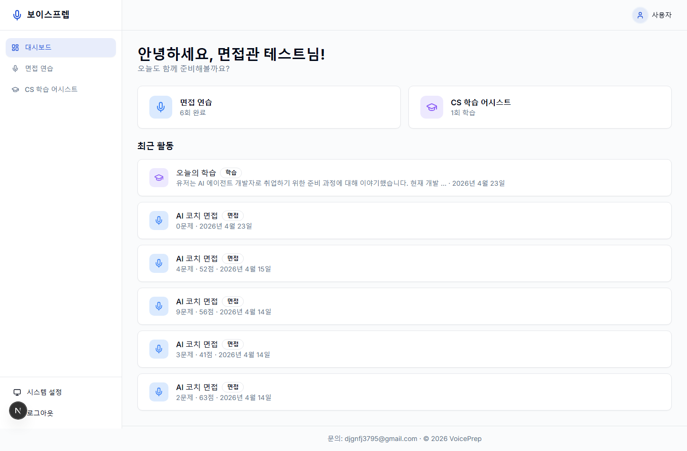
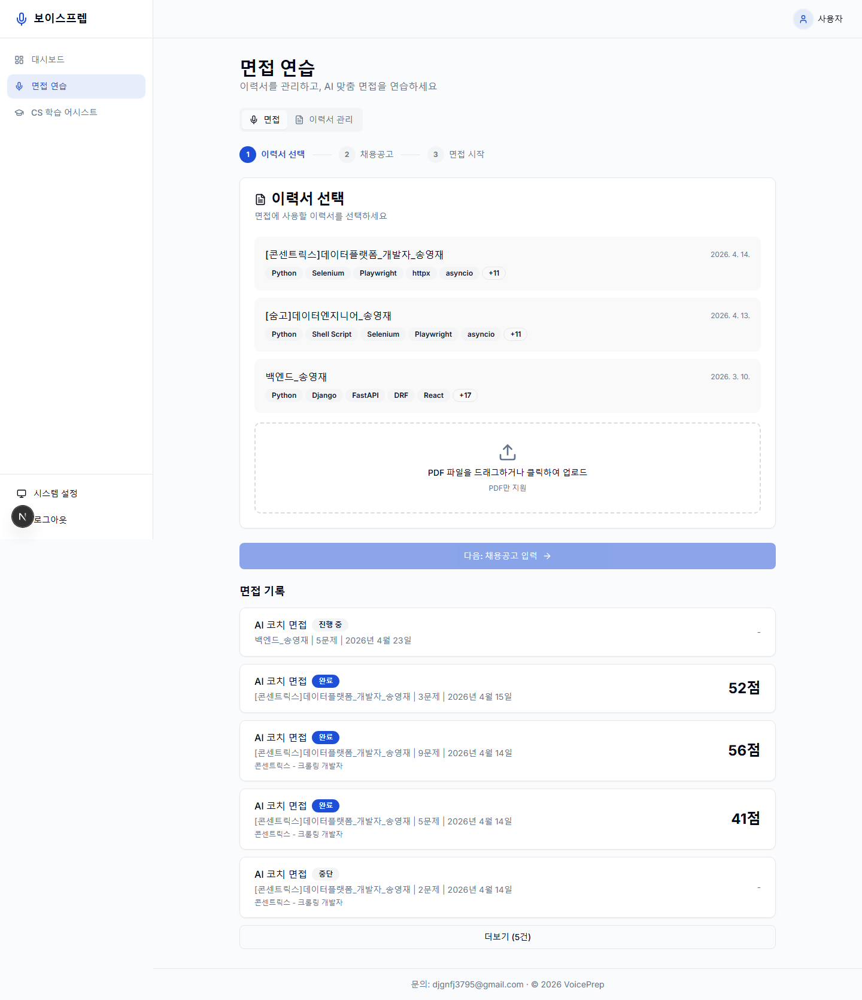
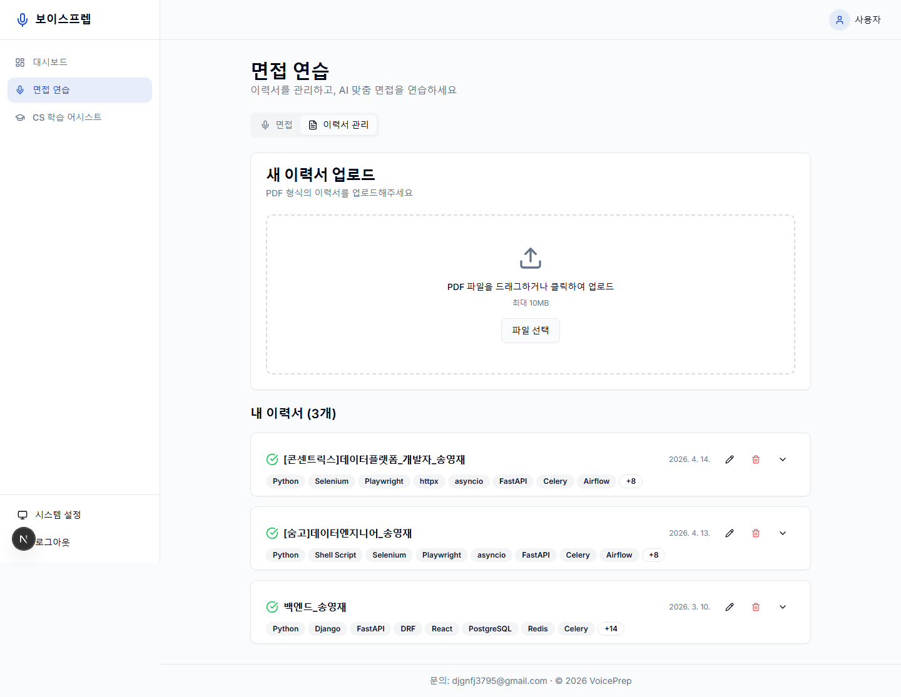

<div align="center">

# 🎙️ 보이스프렙 · VoicePrep

### 말하며 준비하는 개발자 면접

타이핑이 아니라 **실제로 말하며** 연습하는 AI 기술 면접 코치

<br/>


</div>

<br/>

## 무엇인가요?

이력서를 올리면 AI 면접관이 그 내용을 읽고, **실제 면접처럼 음성으로** 질문하고 꼬리질문을 이어갑니다.
답변은 역량별로 채점되고, 면접이 끝나면 AI가 당신을 기억해 다음 면접을 더 깊게 파고듭니다.

> 면접은 글이 아니라 말로 봅니다. 그래서 연습도 말로 합니다.

<br/>

## 🔗 라이브 데모

**👉 [jachana.com](https://jachana.com)**

아래 체험 계정으로 **이메일 로그인**하면 바로 둘러볼 수 있습니다 (또는 본인 Google 계정으로 로그인).

| 이메일 | 비밀번호 |
|--------|----------|
| `test@voiceprep.kr` | `test1234` |

> 이력서·면접 기록이 들어 있는 데모 계정입니다. 공유 계정이라 데이터가 바뀔 수 있어요.

<br/>

## 주요 기능

| | 기능 | 설명 |
|---|------|------|
| 🎙️ | **AI 코치 면접** | 에이전트가 이력서·채용공고를 분석해 **훑기(Scan) → 딥다이브(Dive)** 2단계로 동적 질문을 생성. 답변 깊이에 따라 꼬리질문을 자동으로 이어가고, 프로필을 RAG로 기억합니다. |
| 📝 | **모범답안 학습** | AI가 질문과 모범답안을 함께 생성 → 음성으로 직접 답해보고 → 모범답안을 공개해 비교 학습. |
| 📚 | **CS 학습 어시스트** | OpenAI Realtime API 기반 **양방향 음성 통화형** 학습 코치. SRS(간격 반복)로 복습 일정을 관리합니다. |
| 📊 | **측정 기반 평가** | 명료성·정확성·실무성·깊이·완성도를 0~100으로 채점하고, 가중 합산은 **서버에서 강제 계산**. 대시보드에서 점수 추이를 추적합니다. |

<br/>

## 화면

**대시보드 — 면접 기록과 성장 추이를 한눈에**



**면접 연습 — 이력서 선택부터 AI 자동 설계까지**



**이력서 관리 — PDF 업로드 후 자동 파싱 · 임베딩**



<br/>

## 기술 스택

**프론트엔드** · Next.js 15 (App Router) · TypeScript · TanStack Query · shadcn/ui · NextAuth v5 (Google OAuth)

**백엔드** · FastAPI · SQLAlchemy · PostgreSQL (Supabase) · **LangGraph** (에이전트 오케스트레이션) · **pgvector** (RAG)

**AI** · OpenAI `gpt-4o-mini` (LLM) · Whisper (음성인식) · `text-embedding-3-small` (임베딩) · `gpt-4o-mini-tts` (TTS) · Realtime API (실시간 음성)

**인프라** · Docker Compose · nginx · Cloudflare Tunnel

<br/>

## 아키텍처

```
브라우저 ─▶ nginx ─┬─ /api/auth/* ─▶ frontend (Next.js · NextAuth)
                   ├─ /api/*      ─▶ backend  (FastAPI · LangGraph · pgvector)
                   └─ 그 외        ─▶ frontend
                                        │
                       backend ─▶ tts (OpenAI gpt-4o-mini-tts) · OpenAI API · Supabase(PostgreSQL)
```

- **frontend** — UI와 NextAuth 인증만 담당
- **backend** — API·서비스·프롬프트·AI 로직 전부
- **tts** — OpenAI TTS 래퍼 (페르소나별 톤 지시)

<br/>

## 시작하기

> Docker와 Docker Compose가 필요합니다.

```bash
# 1) 환경변수 준비
cp .env.example .env
# .env 에 OPENAI_API_KEY, DATABASE_URL, NEXTAUTH_SECRET, AUTH_GOOGLE_* 등을 채웁니다

# 2) 개발 스택 기동 (nginx + frontend + backend + tts)
docker compose up -d

# 3) 접속
open http://localhost:81
```

프로덕션은 `docker compose -f docker-compose.prod.yml up -d` (포트 82).

<br/>

## 프로젝트 구조

```
frontend/   Next.js 프론트엔드 + NextAuth 인증
backend/    FastAPI 백엔드 (API · 에이전트 · 프롬프트 · RAG)
tts/        OpenAI TTS 래퍼 서비스
db/         DB 초기화 + 마이그레이션
nginx/      리버스 프록시
tests/e2e/  Playwright E2E (3 viewport · 시각 회귀)
```

<br/>

<div align="center">
<sub>문의: djgnfj3795@gmail.com · © 2026 VoicePrep</sub>
</div>
